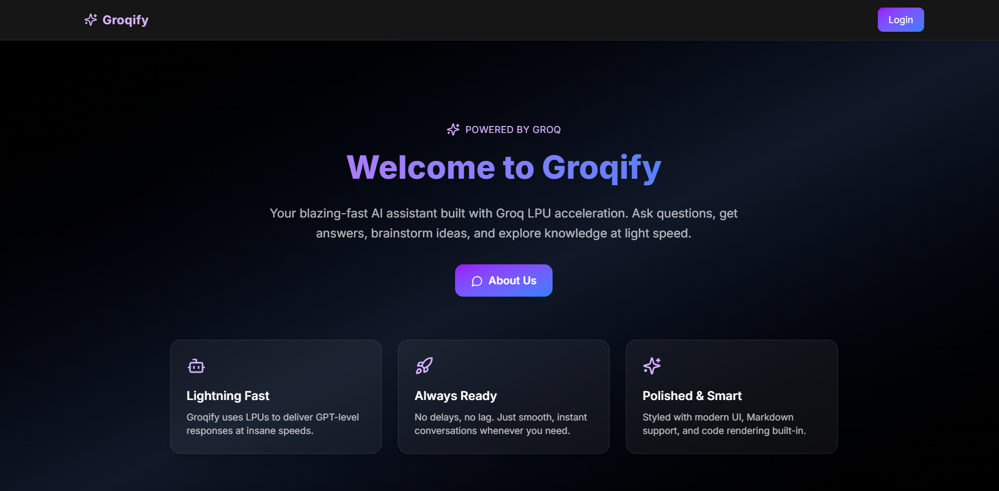
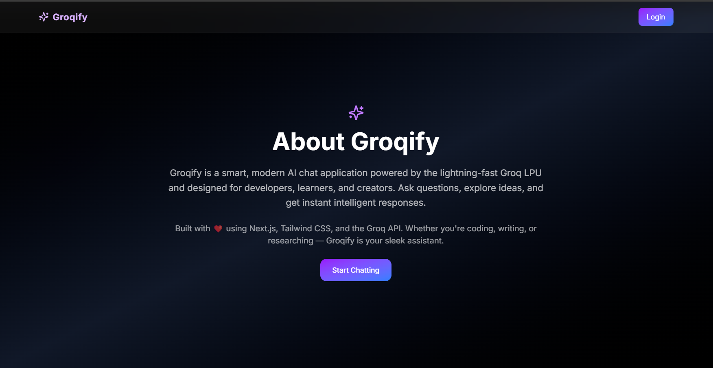
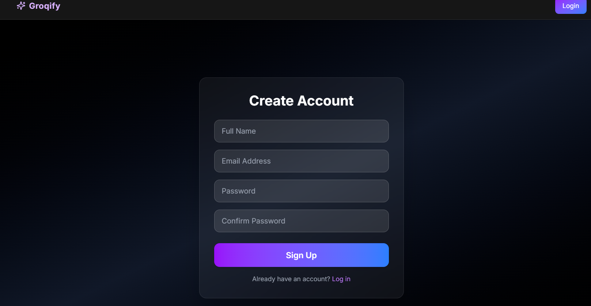
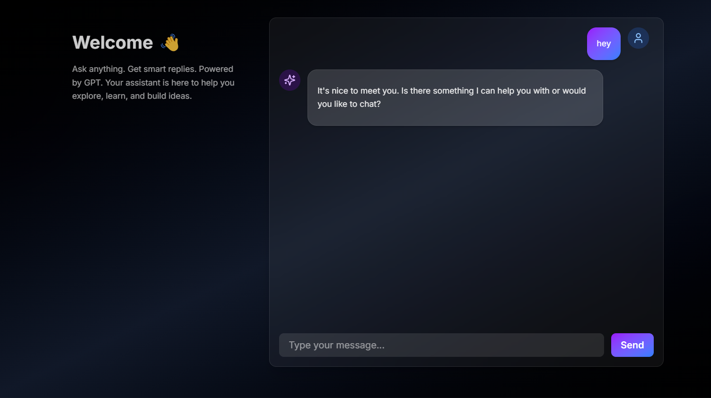
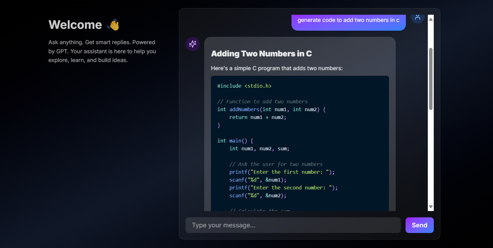
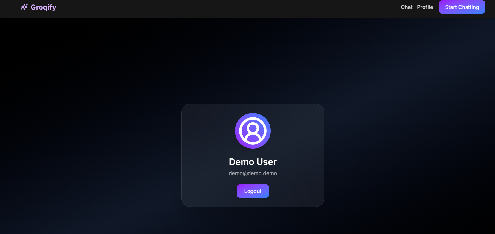

# 💬 Groqify

Welcome to **Groqify** — a blazing fast AI chat experience powered by **Groq** and designed with modern UI in **Next.js**, **Tailwind CSS**, and **Appwrite**. 🚀

---

## ⚡️ What is Groqify?

Groqify is a GPT-powered chat app built for speed. It leverages the **Groq API** for ultra-low latency responses, delivering an almost-instantaneous conversational interface. Styled with elegant gradients and animations, it’s as fast as it is beautiful.

---

## 🧠 Features

- ✨ GPT-based AI assistant (via Groq API)
- ⚡ Lightning-fast, low-latency responses
- 🧑‍💼 Auth system powered by Appwrite
- 🎨 Styled with TailwindCSS & custom animations
- 🌗 Dark glassmorphism UI with blur and gradients
- 🧵 Markdown & syntax-highlighted code rendering
- 👤 User profile with logout support

---

## 🚀 Tech Stack

| Tech           | Description                        |
| -------------- | ---------------------------------- |
| Next.js        | React-based frontend framework     |
| TailwindCSS    | Utility-first styling              |
| Groq           | Ultra-fast LLM inference           |
| Appwrite       | Backend for auth & user management |
| React Markdown | Rich text & code rendering         |

---

## 📸 Screenshots








---

## 🛠️ Getting Started

1. **Clone the repository**

```bash
git clone git@github.com:JaiSinghRajput/hackazardsGroq.git
cd hackazardsGroq
```

2. **Install dependencies**

```bash
npm install
```

3. **Configure environment variables**\
   Create a `.env.local` file and add:

```env
GROQ_API_KEY=your_groq_key_here
NEXT_PUBLIC_APPWRITE_ENDPOINT=your_appwrite_endpoint
NEXT_PUBLIC_APPWRITE_PROJECT=your_project_id
```

4. **Run the app**

```bash
npm run dev
```

---

## 🧠 How it fits the Groq Track

Groqify is built from the ground up to utilize the **Groq API**, pushing the boundaries of low-latency LLM chat. It proves how Groq’s hardware and API empower devs to build next-gen AI experiences that are incredibly fast, lightweight, and user-centric.

---

## 📜 License

MIT © 2025 Jai Singh

---

## 🙌 Acknowledgements

- [Groq](https://groq.com)
- [Appwrite](https://appwrite.io)
- [Tailwind CSS](https://tailwindcss.com)
- [React Markdown](https://github.com/remarkjs/react-markdown)

